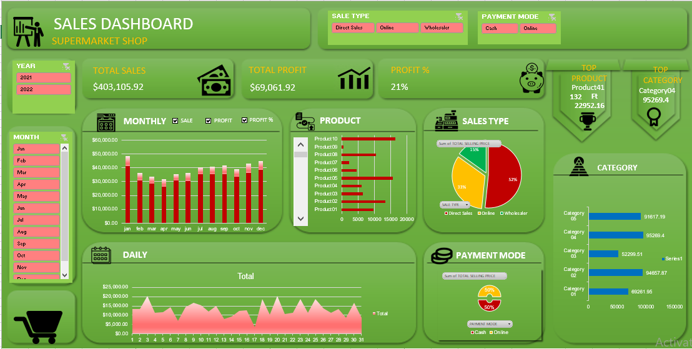

# DATA-ANALYSIS-DASHBOARD USING EXCEL
Comprehensive Excel dashboard for sales data analysis with pivot charts, slicers, and automated visual insights.
# 📊 Supermarket Sales Dashboard (Excel Project)

This project presents an **interactive Sales Dashboard** built in **Microsoft Excel** for a **Supermarket Shop**.  
It provides deep insights into total sales, profit trends, top-performing products, categories, and customer payment modes — all in a single, visually rich dashboard.

---

## 🧠 Project Overview
The **Supermarket Sales Dashboard** is designed to analyze and visualize key business performance metrics.  
It helps decision-makers quickly monitor:
- **Total Sales** and **Total Profit**
- **Profit Percentage**
- **Monthly and Daily Sales Trends**
- **Top Products** and **Top Categories**
- **Sales Type Distribution** (Direct, Online, Wholesaler)
- **Payment Mode Analysis** (Cash, Online)

This dashboard enables users to interactively filter data by **Year** and **Month** using slicers, making it easy to analyze specific time periods.

---

## 🧰 Tools & Techniques Used
- **Microsoft Excel**
  - Pivot Tables for summarizing sales and profit data
  - Pivot Charts for visual representation
  - Slicers for interactive filtering (Year, Month, Sales Type, Payment Mode)
  - Conditional Formatting to highlight key values
  - Data cleaning and transformation using formulas
  - Dashboard design and formatting for professional visualization

---

## 📈 Key Insights
- Total Sales: **$403,105.92**
- Total Profit: **$69,061.92**
- Average Profit Percentage: **21%**
- **Top Product:** Product41 (132 units, $29,252.16)
- **Top Category:** Category04 ($95,269.4)
- Most sales occurred in **November–December**.
- **Direct Sales** contributed the largest share (52%) of total sales.

---

## 🖼️ Dashboard Preview

---

## 📂 Repository Structure

| File Name | Description |
|------------|-------------|
| `Sales-Dashboard-project.xlsx` | Main Excel file containing the interactive dashboard |
| `dashboard1.png` | Dashboard snapshot preview |
| `README.md` | Project documentation file (this file) |

---

## 🚀 How to Use
1. Download the Excel file from this repository.  
2. Open the file in **Microsoft Excel (2016 or later)**.  
3. Enable **Editing** and **Content (Macros)** if prompted.  
4. Use slicers on the left panel (Year, Month, Sales Type, Payment Mode) to explore the data.  
5. Analyze trends, profits, and category performance dynamically.

---

## 🎨 Dashboard Features
- **Dynamic Year and Month Filters:** Instantly switch between 2021 and 2022 data.
- **Monthly & Daily Trends:** Track sales and profit growth over time.
- **Sales Type Analysis:** Understand performance across Direct, Online, and Wholesaler channels.
- **Payment Mode Insights:** Compare Cash vs Online transactions.
- **Top Product & Category Cards:** Automatically highlight best performers.
- **Clean Layout & Modern Design:** Consistent color palette, readable fonts, and icon usage for better interpretation.

---

## 💡 Learning Outcomes
From this project, I learned:
- How to structure and clean sales datasets for dashboard creation.
- Advanced use of **Pivot Tables**, **Slicers**, and **Interactive Charts**.
- Designing professional dashboards with proper layout and visual hierarchy.
- How to communicate business insights effectively through data visualization.

---

## 🔮 Future Enhancements
- Automate data refresh using **Power Query**.
- Add a **forecasting feature** to predict future sales trends.
- Integrate the Excel dashboard with **Power BI** for real-time updates.

---

## 👩‍💻 About Me
**Neha Sharma**  
🎓 MCA (Data Science) | Aspiring Data Analyst  
💡 Passionate about Excel, Data Visualization & Business Analytics  
🔗 [LinkedIn Profile](https://www.linkedin.com/in/neha-s-02a7ba285?utm_source=share&utm_campaign=share_via&utm_content=profile&utm_medium=android_app)  
📧 sharmaneha3720@gmail.com

---

⭐ *If you like this project, don't forget to give it a star on GitHub!*
